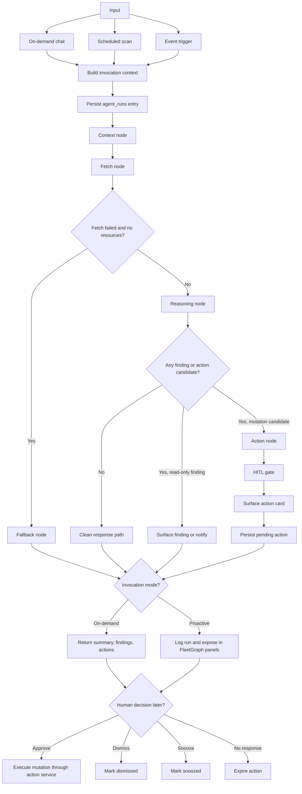

# FleetGraph

## Agent Responsibility

FleetGraph is responsible for monitoring drift between plan and reality across issues, weeks, projects, programs, and people. Proactively, it watches state transitions, assignment changes, failed iterations, week boundary conditions, deadline pressure, missing artifacts like standups or plans, and threshold crossings such as capacity overload. On-demand, it uses the current view as scope so the agent starts with contextual data instead of a cold prompt.

FleetGraph reasons about:

- Sprint and week health
- Capacity and assignment balance
- Blockers and stalled work
- Missing process signals such as standups, plans, and retros
- Priority and next-work ranking
- Cross-project and portfolio drift

FleetGraph can act autonomously when the action is read-only or low-risk:

- Read Ship data and compute derived metrics
- Generate summaries and health reports
- Produce draft content such as standups or weekly plans
- Surface findings and recommendations
- Notify the right audience about conditions worth attention

FleetGraph must require human approval before any state-changing action, including:

- Reassigning issues
- Changing issue state or priority
- Moving issues between weeks or projects
- Creating documents on behalf of a user
- Sending a message that appears to come from a specific person
- Archiving or deleting content

FleetGraph notifies people based on the finding:

- Stale issue: issue assignee first, then week owner if escalation is needed
- Sprint slipping: week owner
- Unresolved blocker: issue assignee, week owner, and PM or project creator
- Missing standup: the person who has not logged one
- Unapproved plan: week owner and approver
- Capacity overload: overloaded person and week owner
- Silent project: everyone with assigned work in that project

On-demand mode uses the current view as context:

- Issue page: the issue, its history, comments, iterations, related sprint or project, and assignee workload
- Week page: the week, associated issues, assigned people, capacity, and prior-week comparison
- Project page: the project, backlog, associated weeks, grouped issues, and team roster
- Program page: child projects, health rollups, blocker counts, and week owners
- Person page: capacity, assigned issues, standup history, and iteration history

## Graph Diagram

The intended architecture is a single graph that supports both proactive and on-demand entry points. The current code already unifies chat and assignment-change events, while the broader proactive scan path remains the target design.

## Use Cases

| # | Role | Trigger | Agent Detects / Produces | Human Decides |
| --- | --- | --- | --- | --- |
| 1 | PM | Midweek scan or asks "how are we tracking?" from a week view | Sprint health summary with done, in-progress, stale, and blocked issues plus plan-vs-reality drift | Whether to cut scope, reassign work, or escalate blockers |
| 2 | Engineer and PM | Failed iteration remains unresolved for 24+ hours | Blocker escalation report showing blocked issue, likely dependency, duration, and impacted people | Whether to reassign, pair, unblock, or re-scope |
| 3 | PM | Assignment change or asks "who's overloaded?" | Capacity table with over-capacity and under-capacity people plus rebalance suggestions | Whether to accept reassignment, change estimates, or defer work |
| 4 | PM or Engineer | New week has no plan, or user asks for a draft | Draft weekly plan using backlog, carryover work, capacity, and blocker context | Which issues to commit to and whether the plan is accurate |
| 5 | Engineer | Asks "what should I work on next?" from person or week view | Ranked next-work list based on in-progress continuity, priority, blockers, and deadlines | What to actually pick up next |

Additional use cases from the presearch that also fit this model include standup drafting and portfolio drift reporting.

## Trigger Model

FleetGraph should use a **hybrid trigger model**: scheduled polling for time-based and absence-based conditions, plus event-driven triggers for immediate state changes.

Why hybrid is the right choice:

- Polling is required for absence signals such as missing standups, missing plans, silent projects, and week-boundary checks.
- Event-driven triggers are better for immediate signals such as failed iterations, assignment changes, and important document state changes.
- A pure webhook model cannot detect "nothing happened" conditions.
- A pure polling model adds latency and unnecessary work for highly actionable events.

Recommended trigger split:

- Scheduled scans
- Morning scan for unapproved plans, missing weekly plans, and capacity overload
- Midweek sprint-health check
- End-of-week spillover and summary scan
- End-of-day missing-standup check

- Event-driven triggers
- Failed `issue_iterations`
- Assignment changes
- Plan approval state changes
- Issue movement into `in_progress`

Tradeoff summary:

| Model | Strengths | Weaknesses | Fit for FleetGraph |
| --- | --- | --- | --- |
| Poll only | Simple, easy to reason about, no write-path instrumentation | Wasteful and slower for urgent events | Not enough on its own |
| Webhook only | Fast and efficient for state changes | Cannot detect absence signals, more API instrumentation | Not enough on its own |
| Hybrid | Covers both time-based absence checks and real-time state changes | More moving parts and dedup complexity | Best fit |

Implementation note:

- The presearch proposes a hybrid system with scheduled scans plus event-driven triggers feeding the same graph.
- The current codebase already supports on-demand chat and assignment-change event invocation.
- The broader proactive scan path is still partially scaffolded, with `proactive-findings` currently acting as a compatibility wrapper rather than the full graph entry point.
