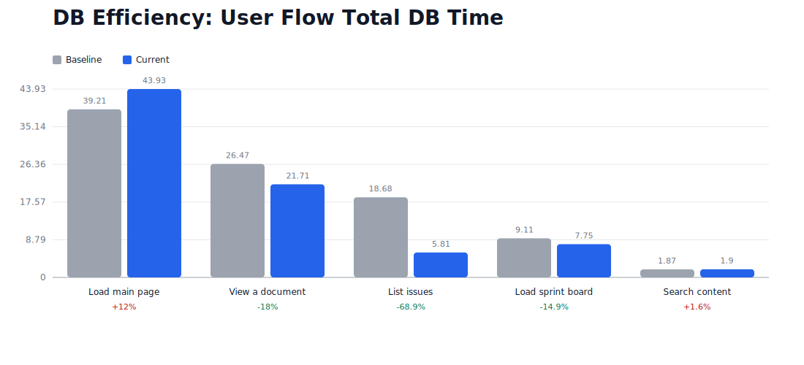
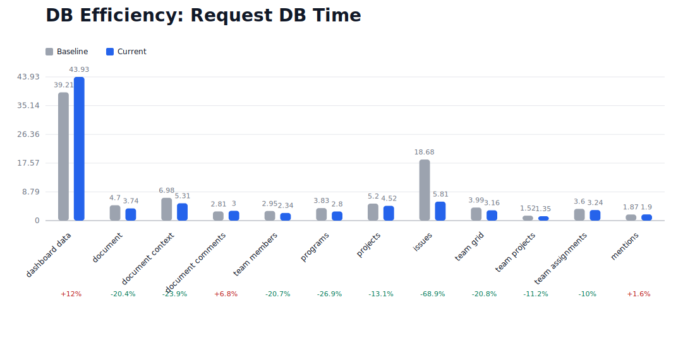

# DB Query Efficiency Comparison

Baseline: 2026-03-12T-baseline-preopt (2026-03-12T15:25:30.786Z)
Current: current-issues-pass (2026-03-12T20:20:06.157Z)
Target: 50% improvement on the slowest affected query
Status: Not met

## Flow Summary



| Flow | Baseline Queries | Current Queries | Query Delta (%) | Baseline DB Time (ms) | Current DB Time (ms) | DB Time Delta (%) | Baseline Slowest (ms) | Current Slowest (ms) | Slowest Delta (%) |
|---|---:|---:|---:|---:|---:|---:|---:|---:|---:|
| Load main page | 9 | 9 | 0% | 39.21 | 43.93 | +12% | 9.18 | 10 | +8.9% |
| View a document | 24 | 24 | 0% | 26.47 | 21.71 | -18% | 4.32 | 3.31 | -23.4% |
| List issues | 4 | 4 | 0% | 18.68 | 5.81 | -68.9% | 15.93 | 2.41 | -84.9% |
| Load sprint board | 17 | 17 | 0% | 9.11 | 7.75 | -14.9% | 1.69 | 1.22 | -27.8% |
| Search content | 5 | 5 | 0% | 1.87 | 1.9 | +1.6% | 0.57 | 0.5 | -12.3% |

## Request Summary



| Flow | Request | Path | Baseline DB Time (ms) | Current DB Time (ms) | DB Time Delta (%) | Baseline Slowest (ms) | Current Slowest (ms) | Slowest Delta (%) |
|---|---|---|---:|---:|---:|---:|---:|---:|
| Load main page | dashboard data | /api/dashboard/my-week | 39.21 | 43.93 | +12% | 9.18 | 10 | +8.9% |
| View a document | document | /api/documents/b6fbd050-8e7f-4db4-8707-dcb7f6789b6a | 4.7 | 3.74 | -20.4% | 1.79 | 1.44 | -19.6% |
| View a document | document context | /api/documents/b6fbd050-8e7f-4db4-8707-dcb7f6789b6a/context | 6.98 | 5.31 | -23.9% | 1.92 | 1.05 | -45.3% |
| View a document | document comments | /api/documents/b6fbd050-8e7f-4db4-8707-dcb7f6789b6a/comments | 2.81 | 3 | +6.8% | 1.8 | 1.26 | -30% |
| View a document | team members | /api/team/people | 2.95 | 2.34 | -20.7% | 1.42 | 0.97 | -31.7% |
| View a document | programs | /api/programs | 3.83 | 2.8 | -26.9% | 2.79 | 1.71 | -38.7% |
| View a document | projects | /api/projects | 5.2 | 4.52 | -13.1% | 4.32 | 3.31 | -23.4% |
| List issues | issues | /api/issues | 18.68 | 5.81 | -68.9% | 15.93 | 2.41 | -84.9% |
| Load sprint board | team grid | /api/team/grid | 3.99 | 3.16 | -20.8% | 1.04 | 0.94 | -9.6% |
| Load sprint board | team projects | /api/team/projects | 1.52 | 1.35 | -11.2% | 0.53 | 0.55 | +3.8% |
| Load sprint board | team assignments | /api/team/assignments | 3.6 | 3.24 | -10% | 1.69 | 1.22 | -27.8% |
| Search content | mentions | /api/search/mentions?q=Standup | 1.87 | 1.9 | +1.6% | 0.57 | 0.5 | -12.3% |

## Before / After EXPLAIN ANALYZE

### programs

What was inefficient: correlated subplans were executed per outer row in the baseline query for this endpoint.
Why the rewrite helps: the current query precomputes counts/status once and joins the aggregated results back by id, so the planner can execute the work set-wise instead of row-by-row.

Baseline slow query: `SELECT d.id, d.title, d.properties, d.archived_at, d.created_at, d.updated_at, COALESCE((d.properties->>'owner_id')::uuid, d.created_by) as owner_id, u.name as owner_name, u.ema...`
Observed: 2.79ms, EXPLAIN total: 0.71ms

Current slow query: `WITH program_issue_counts AS ( SELECT da.related_id AS program_id, COUNT(*)::int AS issue_count FROM document_associations da JOIN documents i ON i.id = da.document_id WHERE da....`
Observed: 1.71ms, EXPLAIN total: 0.41ms

Baseline plan:
```
Sort (0.5ms, 8 rows)
  Hash Join (0.49ms, 8 rows)
    Seq Scan (0ms, 24 rows)
    Hash (0.04ms, 8 rows)
      Index Scan (0.04ms, 8 rows)
    Aggregate (0.03ms, 1 rows)
      Nested Loop (0.03ms, 20 rows)
        Bitmap Heap Scan (0.01ms, 26 rows)
          Bitmap Index Scan (0ms, 26 rows)
        Memoize (0ms, 1 rows)
          Index Scan (0ms, 1 rows)
    Aggregate (0.03ms, 1 rows)
      Nested Loop (0.02ms, 3 rows)
        Bitmap Heap Scan (0.01ms, 26 rows)
          Bitmap Index Scan (0ms, 26 rows)
        Memoize (0ms, 0 rows)
          Index Scan (0ms, 0 rows)
```

Current plan:
```
Sort (0.17ms, 8 rows)
  Hash Join (0.17ms, 8 rows)
    Hash Join (0.12ms, 8 rows)
      Hash Join (0.03ms, 8 rows)
        Bitmap Heap Scan (0.01ms, 8 rows)
          Bitmap Index Scan (0ms, 8 rows)
        Hash (0.01ms, 24 rows)
          Seq Scan (0ms, 24 rows)
      Hash (0.1ms, 8 rows)
        Subquery Scan (0.09ms, 8 rows)
          Aggregate (0.09ms, 8 rows)
            Hash Join (0.08ms, 160 rows)
              Seq Scan (0.03ms, 208 rows)
              Hash (0.03ms, 160 rows)
                Bitmap Heap Scan (0.02ms, 160 rows)
                  Bitmap Index Scan (0ms, 160 rows)
    Hash (0.04ms, 8 rows)
      Subquery Scan (0.04ms, 8 rows)
        Aggregate (0.04ms, 8 rows)
          Sort (0.04ms, 24 rows)
            Hash Join (0.03ms, 24 rows)
              Seq Scan (0.02ms, 208 rows)
              Hash (0.01ms, 24 rows)
                Bitmap Heap Scan (0ms, 24 rows)
                  Bitmap Index Scan (0ms, 24 rows)
```

### projects

What was inefficient: correlated subplans were executed per outer row in the baseline query for this endpoint.
Why the rewrite helps: the current query precomputes counts/status once and joins the aggregated results back by id, so the planner can execute the work set-wise instead of row-by-row.

Baseline slow query: `SELECT d.id, d.title, d.properties, prog_da.related_id as program_id, d.archived_at, d.created_at, d.updated_at, d.converted_from_id, (d.properties->>'owner_id')::uuid as owner_...`
Observed: 4.32ms, EXPLAIN total: 1.27ms

Current slow query: `WITH project_sprint_counts AS ( SELECT da.related_id AS project_id, COUNT(*)::int AS sprint_count FROM document_associations da JOIN documents s ON s.id = da.document_id WHERE d...`
Observed: 3.31ms, EXPLAIN total: 0.9ms

Baseline plan:
```
Sort (0.94ms, 24 rows)
  Hash Join (0.93ms, 24 rows)
    Nested Loop (0.1ms, 24 rows)
      Index Scan (0.05ms, 24 rows)
      Index Scan (0ms, 1 rows)
    Hash (0.02ms, 24 rows)
      Seq Scan (0ms, 24 rows)
    Aggregate (0.01ms, 1 rows)
      Nested Loop (0.01ms, 1 rows)
        Bitmap Heap Scan (0ms, 8 rows)
          Bitmap Index Scan (0ms, 8 rows)
        Memoize (0ms, 0 rows)
          Index Scan (0ms, 0 rows)
    Aggregate (0.01ms, 1 rows)
      Nested Loop (0.01ms, 7 rows)
        Bitmap Heap Scan (0ms, 8 rows)
          Bitmap Index Scan (0ms, 8 rows)
        Memoize (0ms, 1 rows)
          Index Scan (0ms, 1 rows)
    Aggregate (0.01ms, 1 rows)
      Nested Loop (0.01ms, 1 rows)
        Bitmap Heap Scan (0.01ms, 1 rows)
          Bitmap Index Scan (0ms, 24 rows)
        Seq Scan (0ms, 1 rows)
```

Current plan:
```
Sort (0.45ms, 24 rows)
  Hash Join (0.43ms, 24 rows)
    Hash Join (0.26ms, 24 rows)
      Hash Join (0.16ms, 24 rows)
        Hash Join (0.11ms, 24 rows)
          Hash Join (0.08ms, 24 rows)
            Seq Scan (0.04ms, 208 rows)
            Hash (0.01ms, 24 rows)
              Bitmap Heap Scan (0.01ms, 24 rows)
                Bitmap Index Scan (0ms, 24 rows)
          Hash (0.01ms, 24 rows)
            Seq Scan (0ms, 24 rows)
        Hash (0.05ms, 24 rows)
          Subquery Scan (0.05ms, 24 rows)
            Aggregate (0.04ms, 24 rows)
              Sort (0.04ms, 24 rows)
                Hash Join (0.03ms, 24 rows)
                  Seq Scan (0.02ms, 184 rows)
                  Hash (0.01ms, 24 rows)
                    Bitmap Heap Scan (0.01ms, 24 rows)
                      Bitmap Index Scan (0ms, 24 rows)
      Hash (0.09ms, 24 rows)
        Subquery Scan (0.07ms, 24 rows)
          Aggregate (0.06ms, 24 rows)
            Hash Join (0.05ms, 160 rows)
              Seq Scan (0.02ms, 184 rows)
              Hash (0.02ms, 160 rows)
                Bitmap Heap Scan (0.01ms, 160 rows)
                  Bitmap Index Scan (0ms, 160 rows)
    Hash (0.14ms, 24 rows)
      Subquery Scan (0.13ms, 24 rows)
        Aggregate (0.13ms, 24 rows)
          Sort (0.1ms, 24 rows)
            Nested Loop (0.08ms, 24 rows)
              Bitmap Heap Scan (0.04ms, 24 rows)
                BitmapAnd (0.01ms, 0 rows)
                  Bitmap Index Scan (0ms, 24 rows)
                  Bitmap Index Scan (0.01ms, 26 rows)
              Index Scan (0ms, 1 rows)
```

