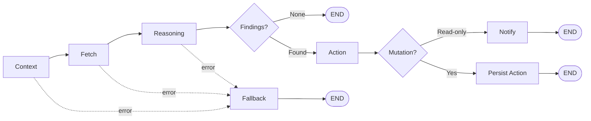
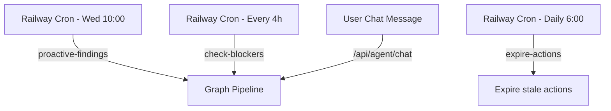
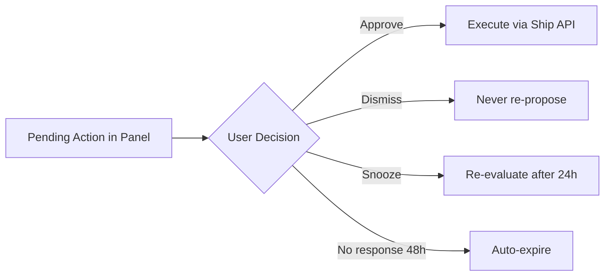

# Feature Specification: FleetGraph Agent Graph Architecture

**Feature Branch**: `002-fleetgraph-graph-arch`
**Created**: 2026-03-17
**Status**: Draft
**Input**: Build the FleetGraph agent graph architecture with context nodes, parallel fetch nodes, reasoning nodes, conditional edges, action nodes, human-in-the-loop gates, and error/fallback handling.

## User Scenarios & Testing *(mandatory)*

### User Story 1 - Proactive Sprint Health Detection (Priority: P1)

The FleetGraph agent runs a scheduled midweek scan on all active sprints. It establishes context (which workspace, which active weeks), fetches sprint issues, people, and iteration history in parallel, then reasons about whether the sprint is on track. When problems are detected (stale issues, blockers, capacity overload), the graph routes through a problem-detected path that surfaces findings to the week owner. When everything is on track, the graph routes through a clean path that logs the result silently without notifying anyone.

**Why this priority**: This is the core value proposition of FleetGraph — proactive drift detection without any human initiating it. Every other use case builds on this pipeline.

**Independent Test**: Can be fully tested by seeding a workspace with an active sprint containing stale issues and blockers, triggering the scheduled scan, and verifying that the agent produces a structured health report with the correct findings and routes to the notification path.

**Acceptance Scenarios**:

1. **Given** an active sprint with 3 completed issues, 2 in-progress (1 stale for 4 days), and 1 blocked, **When** the midweek scan runs, **Then** the agent produces a health summary identifying the stale issue and the blocker, and routes through the problem-detected path to notify the week owner.
2. **Given** an active sprint where all issues are progressing normally, **When** the midweek scan runs, **Then** the agent produces a clean health summary and routes through the clean path, logging the result without sending notifications.
3. **Given** the database is unreachable during a scheduled scan, **When** the scan triggers, **Then** the agent logs the failure, skips the scan gracefully, and retries on the next scheduled interval without crashing.

---

### User Story 2 - On-Demand Chat Analysis (Priority: P1)

A user opens a sprint/issue/project view in Ship and asks FleetGraph a question via the chat interface (e.g., "how are we tracking?" or "what should I work on next?"). The agent receives the user's view context (what document they're looking at, their role, the current date), parses their intent, fetches relevant data, reasons about the answer, and responds conversationally. If the agent determines an action would help (e.g., reassigning an issue), it proposes the action and waits for human confirmation before executing.

**Why this priority**: On-demand chat is the primary user-facing interaction model. Users need to trust that the agent understands their context and provides actionable answers.

**Independent Test**: Can be tested by simulating a chat message from a user viewing a sprint page, verifying that the agent correctly identifies the intent, fetches the right data, and returns a contextually relevant response.

**Acceptance Scenarios**:

1. **Given** a PM is viewing Sprint Week 12 with 8 issues, **When** they ask "how are we tracking?", **Then** the agent fetches week data, issues, and people in parallel, reasons about sprint health, and returns a structured summary comparing plan vs. reality.
2. **Given** an engineer is viewing their person page, **When** they ask "what should I work on next?", **Then** the agent fetches their assigned issues across active sprints, reasons about priority (in-progress first, then blocking others, then high-priority), and returns a prioritized list with reasoning.
3. **Given** a user asks a question but one fetch node fails (e.g., iteration history unavailable), **Then** the agent returns a partial answer clearly labeled as incomplete, rather than failing entirely.

---

### User Story 3 - Event-Driven Blocker Escalation (Priority: P2)

When an engineer logs a failed iteration with blockers on an issue, the agent detects the event immediately, checks if the blocker has been unresolved for more than 24 hours, and if so, escalates by notifying the issue assignee, week owner, and project creator. The notification includes the blocked issue, the blocker description, how long it's been blocked, and any likely blocking issues found by cross-referencing related issues.

**Why this priority**: Blockers are the highest-cost drift signal. Fast detection prevents compounding delays. But this builds on the same graph pipeline as P1 stories, just with a different entry point.

**Dependency**: Requires a frontend iteration logging UI (not yet built). Until then, the agent uses staleness-based blocker detection as a fallback. The event-driven path (`iteration:created` events) activates once the iteration UI ships.

**Independent Test**: Can be tested by inserting an issue_iteration with `status='fail'` and `blockers_encountered` text, advancing the clock past 24 hours, and verifying the agent sends an escalation notification to the correct people.

**Acceptance Scenarios**:

1. **Given** an issue has a failed iteration logged 25 hours ago with no subsequent passing iteration, **When** the blocker escalation timer fires, **Then** the agent notifies the assignee, week owner, and PM with a structured blocker report.
2. **Given** an issue had a failed iteration 25 hours ago but a passing iteration was logged 2 hours ago, **When** the blocker timer fires, **Then** the agent detects the blocker is resolved and takes no action.
3. **Given** a blocker notification was already sent for this issue, **When** the next scan runs and the blocker persists, **Then** the agent escalates (different notification) rather than sending a duplicate of the original notification.

---

### User Story 4 - Human-Gated Mutation Actions (Priority: P2)

When the agent's reasoning determines that a data mutation would help (moving an issue to the next sprint, reassigning a stale issue, changing priority), it packages the proposed action and surfaces it to the user for confirmation. The user can approve, edit-and-approve, dismiss, or snooze the action. Approved actions are executed with an audit trail. Dismissed actions are not re-proposed. Snoozed actions resurface after the snooze period.

**Why this priority**: This is the trust boundary. Users will not adopt FleetGraph if it makes changes without their knowledge. The human gate is essential for all mutation paths.

**Independent Test**: Can be tested by triggering a scenario where the agent proposes a mutation (e.g., stale issue reassignment), verifying the proposal surfaces correctly, then testing each response path (approve, dismiss, snooze).

**Acceptance Scenarios**:

1. **Given** the agent proposes moving a stale issue to next sprint, **When** the user approves, **Then** the mutation executes, the issue's sprint association changes, and the change is recorded with `automated_by: 'fleetgraph'` attribution.
2. **Given** the agent proposes reassigning an issue, **When** the user dismisses, **Then** the action is logged as rejected and the agent does not re-propose the exact same action on subsequent runs.
3. **Given** the agent proposes an action, **When** the user snoozes for 24 hours, **Then** the action is suppressed until the snooze expires, after which the agent re-evaluates the condition and may re-propose if still relevant.
4. **Given** a proposed action receives no response for 48 hours, **Then** it expires and is treated as an implicit snooze.

---

### User Story 5 - Graceful Degradation Under Failure (Priority: P2)

When any node in the graph fails (database timeout, malformed data, LLM service error), the graph handles the failure gracefully. For chat mode, it returns the best partial answer it can with a clear indication of what's missing. For proactive mode, it silently logs the failure and retries on the next scheduled run. The graph never crashes, never sends partial notifications without context, and never loses track of pending actions.

**Why this priority**: Reliability is a prerequisite for trust. An agent that crashes or sends confusing partial alerts will be disabled by users.

**Independent Test**: Can be tested by simulating failures at each node type (fetch timeout, LLM error, database write failure) and verifying the graph routes to the error fallback with appropriate behavior for each mode.

**Acceptance Scenarios**:

1. **Given** 2 of 4 parallel fetch nodes succeed and 2 fail during a chat session, **When** the graph reaches the reasoning node, **Then** the agent analyzes available data and responds with caveats about what information is missing.
2. **Given** the LLM service returns an error during a proactive scan, **When** the error fallback activates, **Then** the scan is logged as failed and no notifications are sent.
3. **Given** a mutation was approved but the database write fails, **When** the error occurs, **Then** the user is informed the action could not be completed, the pending action remains in queue, and no partial state is left in the database.

---

### Edge Cases

- What happens when a sprint has no issues associated with it? The agent should report it as an empty sprint, not crash.
- What happens when a person has no capacity_hours set? The agent should skip capacity calculations for that person and note the missing data.
- What happens when multiple event-driven triggers fire within seconds (e.g., bulk reassignment of 20 issues)? Events should be debounced into a single graph invocation.
- What happens when the agent detects a condition that matches multiple use cases simultaneously (e.g., a stale issue that is also blocked)? The agent should produce findings for both, not suppress one.
- What happens when a chat user switches views mid-conversation? The agent should detect the scope change and re-fetch relevant data.
- What happens when a proactive scan is interrupted mid-execution by a process restart? The incomplete run should be detected on restart and a catch-up scan should run.

## Graph Architecture

### Core Pipeline

**Nodes:**

| Node | What it does | LLM? |
|------|-------------|------|
| **Context** | Extract trigger type, view, actor, workspace, time window | No |
| **Fetch** | `Promise.all` — issues, week, people, iterations. Per-fetch try/catch. | No |
| **Reasoning** | 1) Run deterministic detectors 2) Single LLM call synthesizes findings + handles chat | Yes |
| **Action** | Classify: read-only (notify) vs mutation (propose action) | No |
| **Notify** | Dedup check (24h window via `agent_notifications`), write finding | No |
| **Persist Action** | Write to `agent_actions` with status=pending, expires_at=+48h | No |
| **Fallback** | Chat: return partial results with caveats. Proactive: silent log, no notifications. | No |

### Entry Points

### Human-in-the-Loop (async, after graph completes)

### Execution Paths

| Path | Trace | When |
|------|-------|------|
| **Clean** | Context → Fetch → Reasoning → END | No findings |
| **Notify** | Context → Fetch → Reasoning → Action → Notify → END | Read-only findings |
| **Mutation** | Context → Fetch → Reasoning → Action → Persist → END | Mutation proposed |
| **Fallback** | Any node error → Fallback → END | Node failure |

## Requirements *(mandatory)*

### Functional Requirements

- **FR-001**: The graph MUST support three entry points: scheduled triggers (external cron calling API endpoints), event-driven triggers (API polling for new iterations/changes), and user chat messages, all converging into a unified pipeline. No in-process scheduler; no direct database access from triggers.
- **FR-002**: Context nodes MUST establish the invoker identity (user or system), current view/scope, role, and temporal context (current week, days remaining) before any data fetching begins. For chat entry points, the context node extracts view metadata only (no LLM) — intent classification is handled by the reasoning node alongside analysis in a single LLM call.
- **FR-003**: Fetch nodes MUST execute in parallel when they have no data dependencies on each other (issues, week data, and people fetches run concurrently).
- **FR-004**: Fetch nodes that depend on results from other fetch nodes (e.g., history fetch needing issue IDs) MUST execute sequentially after their dependencies complete.
- **FR-005**: The reasoning node MUST use a hybrid approach: deterministic detectors run first to produce structured findings (drift signals), then a single LLM call synthesizes detector output into natural language responses, handles chat intent, and proposes actions. For proactive scans, detectors are the source of truth; the LLM adds narration. For chat, the LLM handles both intent understanding and analysis in one call.
- **FR-006**: The graph MUST have conditional edges after the reasoning node that route differently based on findings: a clean path (no problems, log/respond only) and a problem-detected path (surface findings, potentially propose actions).
- **FR-007**: The graph MUST route mutation actions through a human-in-the-loop gate that pauses execution and surfaces the proposed action for user confirmation.
- **FR-008**: The human gate MUST support four response types: approve, edit-and-approve, dismiss, and snooze (with configurable duration).
- **FR-009**: All mutations executed by the agent MUST be recorded in document history with `automated_by: 'fleetgraph'` attribution.
- **FR-010**: Read-only actions (notifications, draft generation, health reports) MUST bypass the human gate and execute directly.
- **FR-011**: Every node in the graph MUST have error handling that routes to a fallback node on failure, rather than crashing the graph.
- **FR-012**: The fallback node MUST behave differently based on trigger type: chat mode returns partial results with caveats; proactive mode logs silently and skips.
- **FR-013**: Proactive scans MUST deduplicate notifications using persisted state, preventing the same finding from generating duplicate alerts.
- **FR-014**: Event-driven triggers (detected via API polling for new iterations/changes) from rapid successive mutations MUST be debounced (batched within a single polling interval) into a single graph invocation.
- **FR-015**: The graph state MUST carry fetched data across chat turns within a session, avoiding redundant re-fetching when scope hasn't changed.
- **FR-016**: The graph MUST support scope narrowing at the context/routing level so that only relevant fetch nodes are invoked for each intent type.

### Key Entities

- **Graph State**: The data object passed between nodes containing trigger context, fetched data, reasoning output, and action tracking status.
- **Finding**: A detected drift signal with type, severity, affected documents, and affected people.
- **Proposed Action**: A suggested mutation with the target document, the change description, and the people who need to approve it.
- **Notification**: A read-only alert sent to relevant people about a finding, with deduplication tracking.
- **Pending Action**: A proposed mutation awaiting human response, with expiration and snooze tracking.
- **Run Log**: An audit record of each graph invocation with trigger type, findings, actions taken, and errors encountered. Persisted in `agent_runs` table.
- **Persistence Tables**: `agent_runs` (run logs/audit), `agent_actions` (pending/approved/dismissed/snoozed mutations), `agent_notifications` (deduplication tracking for findings).

## Success Criteria *(mandatory)*

### Measurable Outcomes

- **SC-001**: Proactive scans detect sprint drift signals (stale issues, blockers, capacity overload) within the scheduled scan interval, with zero false negatives on seeded test scenarios.
- **SC-002**: On-demand chat responses return within 5 seconds for standard queries (sprint health, task prioritization) when all data sources are available.
- **SC-003**: The graph handles any single-node failure without crashing, producing a degraded-but-useful response in chat mode 100% of the time.
- **SC-004**: No duplicate notifications are sent for the same finding within a 24-hour window.
- **SC-005**: Human-gated actions correctly pause execution and do not apply mutations until explicit user approval.
- **SC-006**: Parallel fetch nodes complete faster than sequential execution by at least 40% on queries involving 3+ independent data sources.
- **SC-007**: Clean runs (no problems detected) and problem-detected runs produce visibly different execution paths, verifiable through run logs.
- **SC-008**: Dismissed actions are never re-proposed; snoozed actions correctly resurface after the snooze period expires.

## Clarifications

### Session 2026-03-17

- Q: How does chat intent classification work — deterministic patterns, single LLM call, or two-step LLM? → A: Single LLM call (Option B). PARSE_CHAT is a lightweight context-extraction node (view type, document ID, user ID) with no LLM. The raw message plus view context passes directly to the ANALYZE reasoning node, which handles both intent understanding and analysis in one call. Intent becomes a post-hoc label for routing/logging, not a pre-filter. This simplifies the graph, avoids double LLM calls, and allows open-ended questions.
- Q: Where do FleetGraph notifications appear in Ship's UI? → A: Panel-only. Findings appear in existing FleetGraph panels (AssistantPanel, WeekPanel, PortfolioSummary). No push notifications, toasts, or external channels. Users see findings when they open the relevant view. The NOTIFY node writes to the deduplication table but does not push to any delivery channel beyond what the panels already display.
- Q: How should the reasoning node work relative to existing deterministic detectors? → A: Hybrid. Detectors run first to produce structured signals (blocker, stale, slipping scope, etc.), then a single LLM call synthesizes detector output into natural language findings, handles chat intent, and proposes actions. Detectors remain the source of truth for proactive scans; LLM adds narration and open-ended question handling.
- Q: Where should agent operational state (pending actions, run logs, notification dedup) be persisted? → A: New dedicated tables (`agent_runs`, `agent_actions`, `agent_notifications`). These are operational/audit records with specific query patterns that don't fit the unified document model.
- Q: How should the chat UI for on-demand analysis (US2) be implemented? → A: Add chat input and message history to the existing AssistantPanel. No new pages or panels — extend the current component with a text input and conversation thread display.
- Q: Where should human-in-the-loop approval controls (US4) appear? → A: Inline action cards in existing FleetGraph panels alongside findings. When reasoning proposes a mutation, it renders as an action card with approve/dismiss/snooze controls in the same panel where the finding appeared.
- Q: How should scheduled and event-driven triggers work? → A: External cron (Railway cron job) calling Ship API endpoints. No in-process scheduler, no direct DB access. Event-driven blocker escalation uses API polling (calling existing endpoints like GET /api/issues/:id/iterations) rather than DB triggers or in-process event listeners.

## Assumptions

- The existing FleetGraph scaffold from 001-fleetgraph-agent provides the basic agent infrastructure (entry points, API routes, UI panels) that this feature builds upon.
- The agent runs in-process with the Express API server for on-demand requests (chat, guidance). Scheduled and event-driven triggers are external (Railway cron) calling Ship API endpoints.
- Ship's database is the sole data source; the agent accesses data exclusively through Ship API endpoints (no direct DB queries). The existing `ship-api-client.ts` REST client is the data access layer.
- Notifications are panel-only: findings appear in existing FleetGraph UI panels when users open the relevant view. No push notifications, toasts, or external delivery channels.

## Dependencies

- 001-fleetgraph-agent scaffold (completed) provides the entry points and UI shell.
- Ship's existing document model, document_associations, document_history, and issue_iterations tables provide all source data.
- **Iteration logging UI does not exist yet.** The `issue_iterations` table and API endpoint (`POST /api/issues/:id/iterations`) exist, but there is no frontend UI for engineers to log iterations. User Story 3 (blocker escalation) depends on `issue_iterations` records with `blockers_encountered` data. Until an iteration logging UI is built, blocker detection falls back to the existing staleness-based heuristic in `detectBlockers` (issue unchanged for 6+ days).
